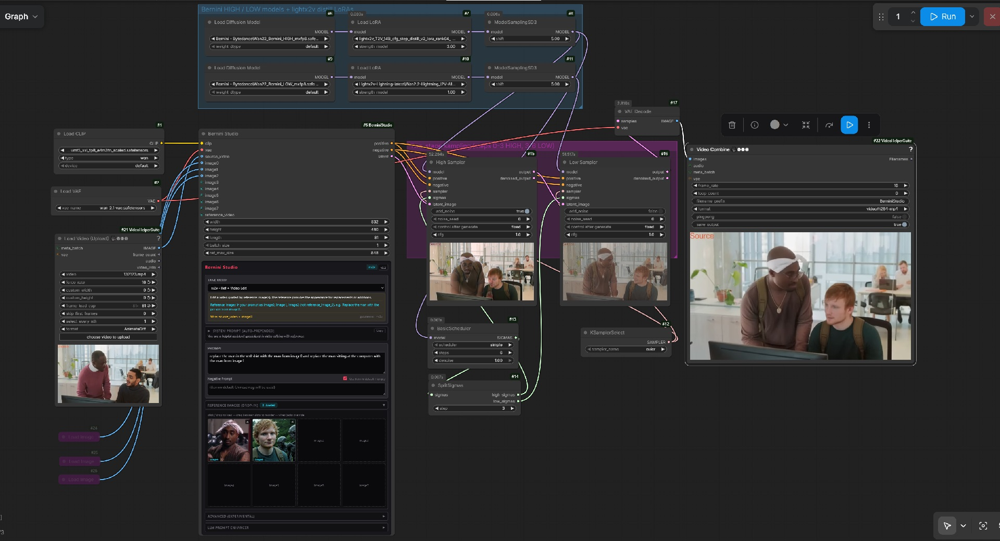
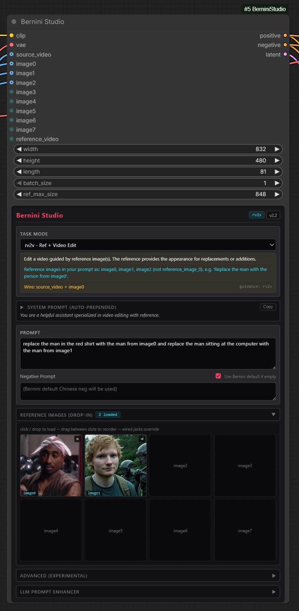

# ComfyUI-BerniniStudio

Single-node wrapper for [Bernini](https://github.com/bytedance/Bernini) video editing in ComfyUI. Handles text encoding, VAE encoding of source video and reference images, and context_latent construction in one node instead of wiring 5+ separate nodes.

Built-in Ollama/vLLM prompt enhancement using Bernini's official per-task templates with optional vision (sends your reference images to the LLM for accurate descriptions).

**This is a personal tool shared as-is. Vibecoded bouncing ideas and code between Claude Opus 4.6max & Gemini 3.1pro. No guarantees/support/maintenance commitment – it is what it is.**




## Requirements

- Bernini model weights from [HuggingFace](https://huggingface.co/ByteDance/Bernini-R) or [Kijai's FP8 repacks](https://huggingface.co/Kijai/WanVideo_comfy_fp8_scaled/tree/main/Bernini)

## Install

Clone into `ComfyUI/custom_nodes/`:

```
cd ComfyUI/custom_nodes
git clone https://github.com/CCpt5/ComfyUI-BerniniStudio.git
```

## Reference images in prompts

The input slots are named `image0` through `image7`. Use the same names in your prompt text:

```
Replace the man with the old man from image0
```

Not `reference_image_0`, not `source_video`, not `the person in image0`. The trained format is **"from image0"**.

Fill slots in order starting from `image0`. If you skip slots (e.g. only connect `image6`), it gets compacted to `image0` internally. The slot number only matches the prompt marker if you fill sequentially.

The source video is implicit -- don't name it in your prompt. Just describe what's in the video naturally.

## Task modes

The dropdown selects a system prompt and configures the hint panel. It does not change any model behavior -- the actual "mode" comes from what you wire and how you set up the sampler.

| Mode | What it does | Wire | Guidance |
|------|-------------|------|----------|
| v2v | General video edit | source_video | v2v_apg |
| rv2v | Edit guided by reference image | source_video + image0 | rv2v |
| r2v | Generate video from reference subject | image0 | r2v_apg |
| t2v | Text to video | nothing | t2v_apg |
| mv2v | Change motion/pose | source_video | v2v_apg |
| ads2v | Insert logo/ad into scene | source_video + image0 | v2v_apg |
| i2i | Image editing | source_video (1 frame) | v2v |
| r2i | Image from reference subject | image0 | r2v_apg |
| i2v | Animate a reference image | image0 | r2v_apg |

## LLM prompt enhancement

Collapsible panel in the node. Supports Ollama and OpenAI-compatible endpoints (vLLM, LiteLLM). Uses Bernini's official prompt templates from their repo.

With a vision-capable model (llava, gemma4, etc.), connected reference images are automatically fetched from LoadImage nodes and sent to the LLM as base64. Works through intermediate nodes (Resize, Preview, etc.) -- the graph is traced backwards to find the original LoadImage.

Auto-enhance checkbox runs the enhancement server-side on every queue. Enhanced text is logged to the ComfyUI console (not the browser). The prompt field in the node may not visually update but the enhanced version is what gets encoded.

## Credits

Bernini by ByteDance: https://github.com/bytedance/Bernini
ComfyUI integration based on Kijai's PR #14216
Vibecoded by JohnDopamine w/ Claude Opus 4.6max (+Gemini 3.1pro)
